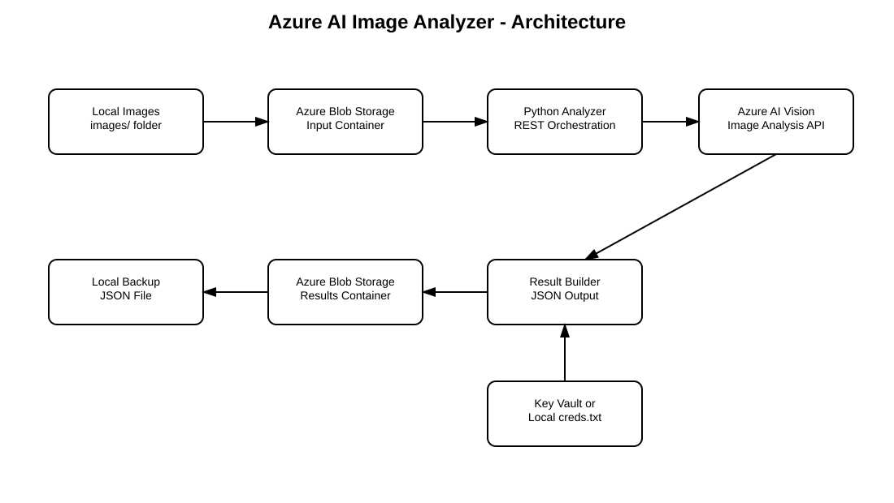
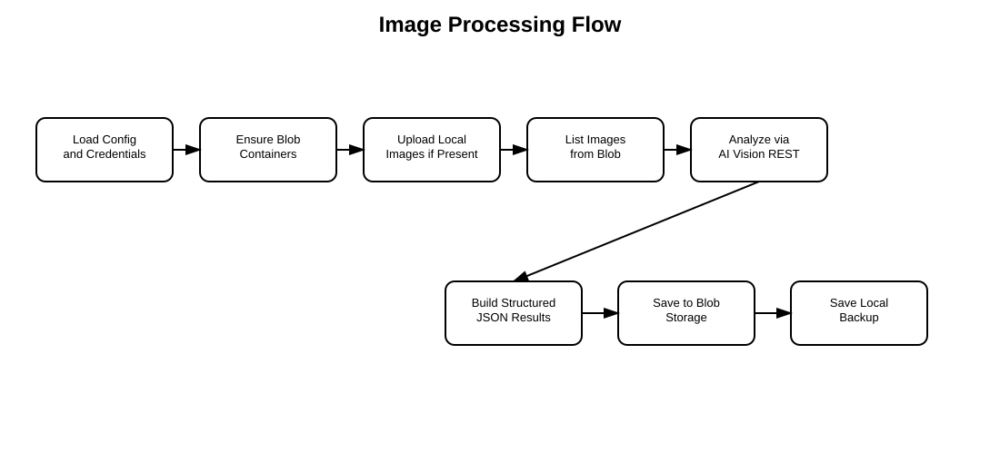

# Azure AI Image Analyzer


Azure AI Image Analyzer is a Python-based Azure AI Vision lab that analyzes images stored in Azure Blob Storage and writes structured JSON results back to Blob Storage.

The project demonstrates:

- Azure AI Vision image analysis through REST API
- Azure Blob Storage input and output containers
- optional Azure Key Vault credential retrieval
- local development credentials through `creds.txt`
- configurable target keyword detection
- JSON result generation with captions, tags, objects, confidence scores, and summary statistics

> This is a lab / proof-of-concept project. It is intended for learning, testing, demos, and portfolio use. It is not a production-ready image processing platform.

---

## Why This Project Exists

Many cloud and AI demos stop at a single API call. This project shows a more practical pattern:

1. Store images in Blob Storage.
2. Analyze each image through Azure AI Vision.
3. Extract captions, tags, detected objects, and confidence scores.
4. Match results against configurable target keywords.
5. Save full analysis output to Blob Storage.
6. Keep credentials outside the source code.

This makes the project useful as a hands-on Azure AI lab and as a base for larger use cases such as image cataloging, content tagging, asset classification, or AI-assisted metadata extraction.

---

## Architecture



Main components:

- Python analyzer
- Azure Blob Storage input container
- Azure AI Vision / Computer Vision endpoint
- Azure Blob Storage results container
- optional Azure Key Vault for secrets
- local `creds.txt` for development only

---

## Processing Flow



The analyzer performs this flow:

1. Load configuration from `config.json`, or create a default configuration.
2. Load credentials from Key Vault or local `creds.txt`.
3. Ensure input and result containers exist.
4. Upload local images from the `images/` folder if present.
5. List images from the input container.
6. Analyze each image using Azure AI Vision REST API.
7. Extract captions, tags, objects, and target keyword matches.
8. Save timestamped result JSON and `image_analysis_latest.json` to Blob Storage.
9. Save a local backup JSON file.

---

## Current Status

| Area | Status |
|---|---|
| Azure Blob Storage integration | Implemented |
| Azure AI Vision REST API call | Implemented |
| Key Vault credential loading | Implemented |
| Local credential file loading | Implemented |
| Configurable target keywords | Implemented |
| Result JSON generation | Implemented |
| Local image upload to Blob Storage | Implemented |
| Automated Azure resource deployment helper | Implemented |
| Docker/container production deployment | Not included in current polished scope |
| Web interface | Not included |
| Production monitoring and scaling | Not included |

---

## Repository Structure

```text
azure-ai-image-analyzer/
  README.md
  LICENSE
  requirements.txt
  .gitignore

  azure_ai_image_analyzer.py
  deploy_azure_resources.py
  quick_start.ps1
  quick_start.sh

  docs/
    images/
      architecture-azure-ai-image-analyzer.svg
      processing-flow.svg
    sample-output/
      image_analysis_latest.json

  images/
    optional local sample images, not required
```

---

## Prerequisites

- Azure subscription
- Azure CLI installed and authenticated
- Python 3.12+
- Azure AI Vision / Computer Vision access in your selected region
- Permissions to create or use:
  - Resource Group
  - Storage Account
  - Blob containers
  - Azure AI Vision resource
  - Key Vault, if using Key Vault mode

Install Python dependencies:

```bash
pip install -r requirements.txt
```

---

## Authentication Options

### Option 1: Local credentials for development

Create `creds.txt` in the repository root:

```text
storage_connection_string=DefaultEndpointsProtocol=https;AccountName=...
vision_endpoint=https://your-vision-service.cognitiveservices.azure.com/
vision_key=your_vision_api_key
```

Set:

```powershell
$env:CREDENTIAL_METHOD = "local"
```

or in Bash:

```bash
export CREDENTIAL_METHOD="local"
```

`creds.txt` must not be committed.

### Option 2: Azure Key Vault

Store these secrets in Key Vault:

```text
storage-connection-string
vision-endpoint
vision-key
```

Set:

```powershell
$env:CREDENTIAL_METHOD = "keyvault"
$env:KEY_VAULT_URL = "https://your-keyvault.vault.azure.net/"
```

or in Bash:

```bash
export CREDENTIAL_METHOD="keyvault"
export KEY_VAULT_URL="https://your-keyvault.vault.azure.net/"
```

---

## Configuration

The analyzer uses `config.json`. If the file does not exist, the application creates a default configuration.

Example:

```json
{
  "analysis_settings": {
    "target_keywords": ["cat", "dog", "animal", "pet"],
    "confidence_threshold": 0.5,
    "max_tags": 10,
    "features": ["caption", "tags", "objects"]
  },
  "containers": {
    "input_container": "input-images",
    "results_container": "analysis-results"
  },
  "naming_convention": {
    "storage_prefix": "aianalyzer",
    "vision_prefix": "ai-vision",
    "keyvault_prefix": "ai-kv"
  }
}
```

---

## Deploy Azure Resources

The helper deployment script uses Azure CLI to create the basic Azure resources.

```bash
python deploy_azure_resources.py --resource-group my-ai-analyzer-rg --location eastus
```

The script can create:

- Resource Group
- Storage Account
- Blob containers
- Azure AI Vision resource
- Key Vault
- local `creds.txt` for development

Review the generated resources and permissions before using this outside a lab.

---

## Run the Analyzer

### PowerShell

```powershell
python -m venv .venv
.\.venv\Scripts\Activate.ps1
pip install -r requirements.txt

$env:CREDENTIAL_METHOD = "local"
python .\azure_ai_image_analyzer.py
```

### Bash

```bash
python -m venv .venv
source .venv/bin/activate
pip install -r requirements.txt

export CREDENTIAL_METHOD="local"
python ./azure_ai_image_analyzer.py
```

The analyzer will upload local images from `images/` if that folder exists. If no local images exist, add images directly to the configured Blob Storage input container.

---

## Output Format

The analyzer writes result JSON to the configured results container.

Files:

```text
image_analysis_YYYYMMDD_HHMMSS.json
image_analysis_latest.json
```

Sample output:

```text
docs/sample-output/image_analysis_latest.json
```

---

## Cost Notes

This lab may create billable Azure resources:

- Azure AI Vision / Computer Vision calls
- Storage Account capacity and transactions
- Key Vault operations, if Key Vault mode is used

Delete lab resources after testing.

---

## Security Notes

- Do not commit `creds.txt`, `.env`, generated `config.json`, or result files.
- Prefer Key Vault for shared environments.
- Rotate AI Vision keys if they are accidentally exposed.
- Review Key Vault access permissions.
- Do not upload sensitive, private, regulated, or customer images into a public demo environment.
- Review generated JSON before sharing it publicly, because captions/tags may reveal image content.

---

## Cleanup

Delete the lab resource group:

```bash
az group delete --name my-ai-analyzer-rg --yes --no-wait
```

Before cleanup, confirm the resource group contains only lab resources.

---

## Limitations

This project intentionally does not include:

- web UI
- production container deployment
- queue-based batch processing
- event-driven processing from Blob upload
- private endpoint/network isolation
- human review workflow
- image moderation policy engine
- guaranteed object or breed identification accuracy

---

## Suggested GitHub Repository Metadata

Description:

```text
Azure AI Vision lab for analyzing images from Blob Storage and saving structured JSON results with captions, tags, objects, and confidence scores.
```

Topics:

```text
azure ai-vision computer-vision blob-storage key-vault python image-analysis azure-ai artificial-intelligence cloud-lab
```

---

## License

MIT License. See [LICENSE](LICENSE) for details.
